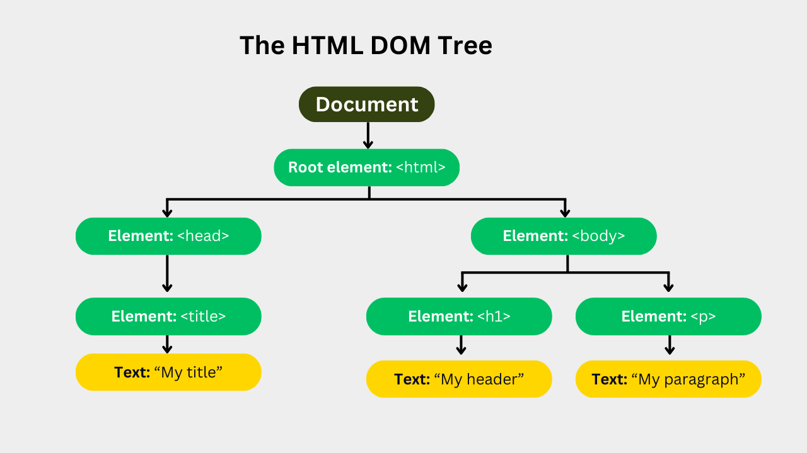

# AHF Documentacion BOM (Browser Object Model)
| DWEC JAVASCRIPT BOM |
|:-----------:|
|
| DESARROLLO WEB ENTORNO CLIENTE 

## 1. BOM JAVASCRIPT (Browser Object Model)

Este documento es una documentación sobre el BOM de Javascript , conteniendo en ella toda la información necesaria asi como los métodos o los objetos que lo componen.

### 1.1 ¿Que es el BOM? (Browser Object Model)

El BOM (Browser Object Model o Modelo de Objetos del Navegador) es un conjunto de objetos y propiedades que permite a JavaScript interactuar con el navegador y su entorno, controlando elementos como la ventana, el historial o las alertas. A diferencia del DOM (Modelo de Objetos del Documento), que se enfoca en el contenido HTML de una página, el BOM maneja el entorno del navegador en sí.

### 1.2 Componentes principales del BOM 

En esta imagen podemos comprobar la estructura de árbol que tiene el BOM , desde el elemento raiz Window hasta todos sus hijos como el Document el cual representa el DOM (Document Object Model).

  #### Window: 

  Es el objeto raíz y el punto de entrada al BOM. Representa la ventana del navegador y contiene todos los demás objetos. (Es soportado por todos los navegadores).
  - MÉTODOS: 

    - window.open() : Abre una nueva ventana.
    - window.close() : Cierra la ventana actual.
    - window.moveTo() : Mueve la ventana actual.
    - window.resizeTo() : Redimensiona la ventana.
    - alert() : Muestra una alerta en la ventana.

  #### Document Object

  El objeto Document es hijo de Window y representa la parte del DOM (Document Object Model) , con todos sus métodos y nodos en conjunto.

  Representa el nodo root de un documento HTML.

  Se puede acceder a el mediante window.document() o simplemente document().

 - MÉTODOS: 
  
    Los siguientes métodos y propiedades pueden ser usados en los documentos HTML.

    - activeElement() : Devuelve el elemento con el foco del documento.
    - getElementByid() : Devuelve el elemento del documento HTML con dicha id.
    - write() : Escribe expresiones HTML o JavaScript en el documento.
    - URL : Devuelve la url completa del documento.

